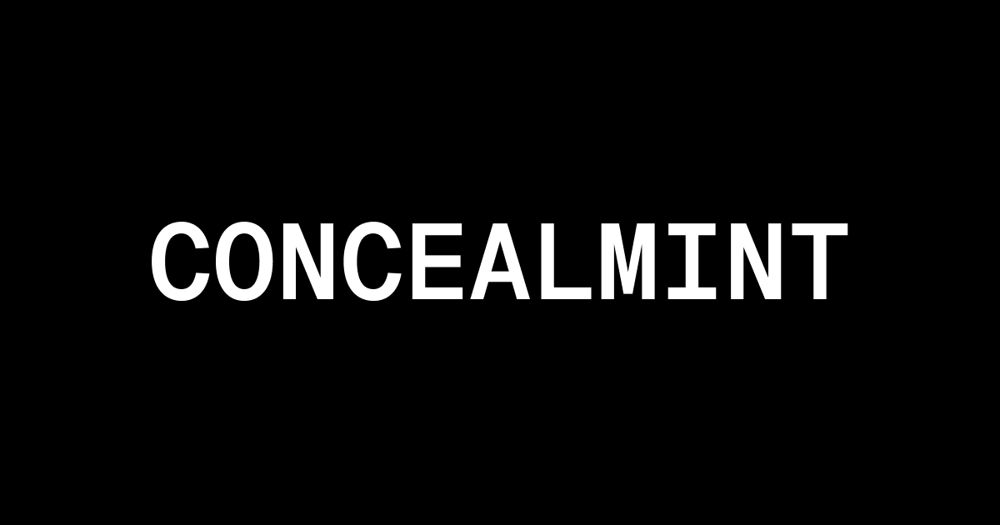

## Concealmint Contacts



This repo contains the main ERC721 contract used for [CONCEALMINT](https://concealmint.com) that features a few small differences than the default contract:

- `safeMint` is made public so anyone can mint
- `safeMint` will mint directly to `msg.sender` instead of taking an `address` parameter
- `safeMint` accepts a `uri` parameter on mint as the content is dynamic
- `constructor` does not take in an owner address, instead the `Ownable` constructor uses `msg.sender`

## Usage

### Build

```shell
$ forge build
```

### Test

```shell
$ forge test
```

### Format

```shell
$ forge fmt
```

### Gas Snapshots

```shell
$ forge snapshot
```

### Anvil

```shell
$ anvil
```

### Deploy

```shell
$ forge script script/Counter.s.sol:CounterScript --rpc-url <your_rpc_url> --private-key <your_private_key>
```

### Cast

```shell
$ cast <subcommand>
```

### Help

```shell
$ forge --help
$ anvil --help
$ cast --help
```
